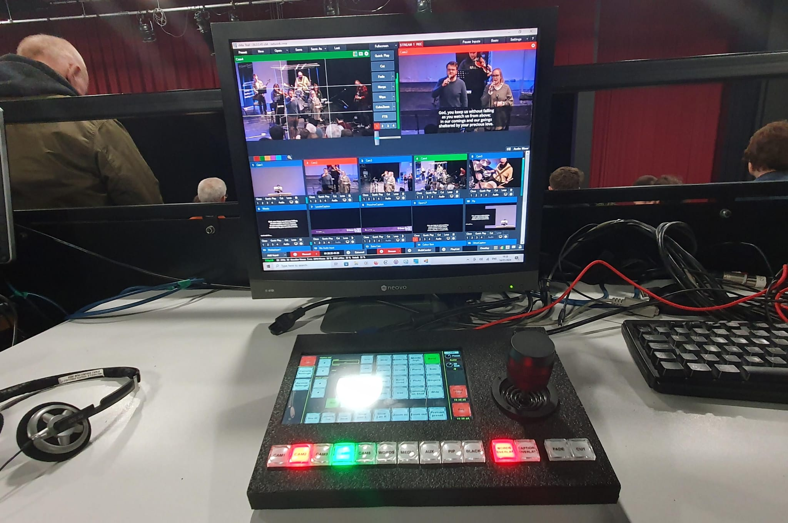

# CCN-Camcontrol

Vb.net App to control Panasonic ptz cameras and VMix from custom touchscreen controller.

## Controller details

The controller is made from a USB touchscreen module, with an Arduino reading a row of illuminated buttons and a 3 axis joystick. The USB touchscreen is directly connected to the PC as an additional screen.

A USB hub in the controller combines the USB touchscreen and the Arduino into a single USB connection into the PC. The Arduino appears as a COM port on the PC.

